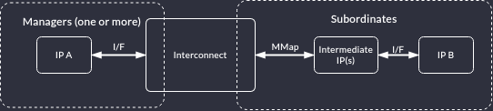

# Memory Map Translation

The plugin assumes that the interconnection network can be represented as a tree graph.
It consists of a single interconnect node as the root and each leaf of the tree graph corresponds to an instantiated IP core whose module has an assigned Renode device.
Managers are direct children of the root node and have an assigned Renode CPU.
Every subordinate is either a leaf node or the start of a sequence of intermediate IP cores that do not have an assigned Renode device (which the leaf node *has*).

:::{figure-md} mmap

Memory map model. IP cores `A` and `B` have assigned Renode peripherals. `B` inherits the `MMap` of the intermediate IP(s), if any.
:::

The tree is constructed starting with the root being the [interconnect](https://antmicro.github.io/topwrap/developers_guide/internal_representation.html#topwrap.model.interconnect.Interconnect).
Each [manager](https://antmicro.github.io/topwrap/developers_guide/internal_representation.html#topwrap.model.interconnect.Interconnect) is a direct child of the root and **must** map to an instantiated IP core that also has an assigned Renode CPU.
Every other branch from the root are cores with assigned memory maps (*offset* and *size*).
These branches are then expanded by walking interface connections (of any type) and stop as soon as a device with an assigned Renode peripheral is encountered: these become the leaf nodes.
Each node that is not directly connected to the interconnect is assigned the memory map of its parent (this rule applies recursively).

The algorithm is implemented as a DFS under the assumption that the interconnection network is a tree graph.
